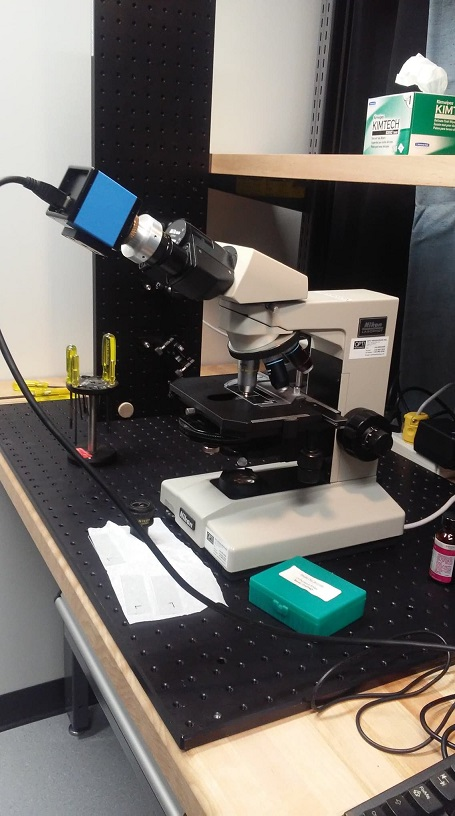

---

typora-copy-images-to: ./
---

| **Arnaud Mercier - 111 156 297** | Date: 16 Octobre 2018 |
| -------------------------------- | --------------------: |
|                                  |                       |

# Microscopie 

---
## Préparation

+**Photo du montage**

## Préparation

La préparation n'as pas été fait, car nous avions péparé un plan pour le HiLo à la place. Nous pensions que nous ferions le HiLo out de suite. Nous allons donc faire la premi're partie de l'exprience microscopie pour se familiariser avec le système et vommencer à monter le hilo  fin de période ou la semaine prochaine.

## Mise au point et alignement 

- L'illumination est mise à intensité moyenne

- On installe un échantillon de bactéries colorés déjà préparé sous lamelle et facile à voir (**Trouver référence**). 

- Le bon objectif d'alignement est choisi, soit l'objectif 10x qui possède ici la plus grande ouverture numérique, soit la plus grande profondeur de champ, ce qui permet d'arriver au focus plus facilement. 

- Le condenseur est avancé à quelques millimètres de l'échantillon en mode champ clair ("O") et le diaphragme d'ouverture est ouvert afin de laisser passer le plus de lumière. 

- La mise au point sur l'échantillon est effectuée.

  > Il est noté que la mise au point se fait généralement très proche de l'objectif et qu'il est du coup plus efficace de commencer le balayage en se rapprochant le plus près possible de l'objectif et descendre lentement jusqu'à la mise au point. 

## Installation de la caméra

- La camera est vissé sur l'oculaire (modèle DMK 21AF04)
- Le logiciel IC Capture est ouvert. Il reconnait la caméra et on peut y voir l'image en temps réel
- On garde le même échantillon que plus tôt pour calibrer le système. 

- On remet l'image au focus pour la caméra (ce qui ne se trouve pas à la même endroit que pour l'observation a l'oculaire)

## Observation des échantillons biologiques

- Préparation des échantillons de levures et bactéries : 15 $\mu$l pour bactérie et 100 $\mu$l sur la me de microscope d'une solution déja péparer dans le frigo.

- Un échantillon de levure est placé sous le microscope avec l'objectif 40x  non Ph -> photo enregistré levure_40x.JPG
- L'image est mise au focus sur la caméra et enregistrée sur le logiciel 
- L'échantillon est remplacée par celle des bactéries.
- On observe aucunes bactéries avec les objectifs sans contraste de phase
- set l'illumination à Ph3 avec objectif 40x Ph3
- L'oculaire sans caméra est remplacé par la lentille de Bertrand et on observe l'anneau du condenseur.
- Cet anneau est aligné au centre à l'aide des vis de déplacement du condenseur. 
- L'image est mise au focus sur la caméra et enregistrée sur le logiciel -> `bacteries_40x.jpg`

> Il y a dans l'image beaucoup de saletés provenant des lentilles. vrmt bcp

- On place une goutte d'huile à objectif type A sur l'échantillon afin d'utiliser l'objectif 100x Ph4
- Un image des bactéries est enregistrée avec et sans contraste de phase sous les noms `bacteries_100x_2_Ph4.jpg`  & `bacteries_100x_2 _O.jpg`)
- Bien qu'on observe assez bien les bactéries avec contraste de phase, elles sont pratiquement invisble sans.
- La distance de travail de l'objectif 100x est **très courte**. -> aire attention pour ne pas briser la lamelle en descndant trop proche.
- 

Par contrainte de temps, et sachant que la deuxième partie de l'expérience ne sera pas faite (afin de travailler sur le montage HiLo), la calibration des dimensions observées est laissé de côté. Le but et les manipulations de cette étape sont toutefois bien comprises. 

# Microscopie HiLo					23    octobre

-----

## But général

Transformer un système de microspie standard en système HiLo. Le gros défi sera de créer une illumination à l'aide du laser He-Ne qui pourra illuminer tout l'chantiilon en passant dans le relais 4f du mircroscope existant.

### Plan du montage à effectué

## Préparation (étapes à faire):

- Trouver l'objectif désiré (demander à daniel)
- Trouver un diffuseur (feuille de papier) et le fixer sur la plaque vertical à l:a focal de la premier lentille du 4f
- Placer un pin hole  à la sortie du diffuseur pour 'cleaner' le faisceau (colimé) et avoir le bon diamètre (pour remplir le back aperture de l'objectif)
- Trouver une combinaison de lentille permettant de focalisé le faisceau un peu avant l'objectif de sorte qu'il diverge à nouveau et remplisse l'objectif
- Monter  l'objectif et le cube et vérifier que le faisceau remplit l'objectif
- L'objectif doit être placé à une BFL  --> **Faux!!** finalement, on veux juste avoir un beau faisceau (bon diamètre (assez gros pour remplir l'objectif))
- Placer l'échantillon au point focale de l'objectif ou working distance
- Placez la caméra sur la plaque verticale en haut du cube séparateur
- Placez une lentile convergent entre le cube et la caméra. Ajuster la position de la caméra pour que l'image remplisse le capteur.x

- S'assurer que le l'illumination uniforme est **uniforme** . Si ce n'est pas le cas, trouver une façon de l'uniformiser.
- Prendre des images Hi et Lo puis les combiner dans FiJI
- Comparer les images Hi Lo avec un confocale et prouver son bon fonctionnement malgré son faible cout.

## Manipulations

### Trouver l'objectif désiré:

L'objectif utilisé est en fait le système 4f intégré du microscope. La tête comportant les oculaires sont retirées et le faisceau est dirigé vers le système 4f interne du microscope.

### Installation d'un relais 4f 

le premier relais 4f à pour effet seulement de grossir le faisceau. Le faisceau entre collimé et ressort collimé. Les lentilles utilisées sont de focale 2.54 cm et de 20 cm, produisant un grossissement de 8. L'importnt est que le faisceau soit centré et ne *clip* pas sur aucun composantes optique. La distance entre le relais et l'objectif n'a alors pas d'importance, car le faisceau est collimé. 

### Trouver un diffuseur  et  le fixer  apres le premier 4f:

2 diffuseurs différents ont été essayé . Il est placé entre 2 lames de microscope. Dans le montage, il est placé avant le séparateur (lame de verre). 

| Type de diffuseur                                        | Commentaire                                                  |
| -------------------------------------------------------- | ------------------------------------------------------------ |
| Papier pour nettoyer les lentilles entre 2 lame de verre | Diffuse bien mais encore un peu trop                         |
| Verre dépoli beaucoup                                    | diffuse beaucoup trop, aucune lumiére observé en réflexion   |
| Verre dépolie grossièrement                              | pas essayer                                                  |
| sans diffuseur                                           | Il y a assez de lumière pour éclairer l'échantillon et observer de la réflexion |

Nous n'avons pas pris le temps d'esssayer tous les diffuseurs pour trouver celui qui produit les plus beaux **speckles**

### Positionnement de la plaque de verre feant office de de cube séparateur:

Plaque de verre trop près du plan image du microscope, on voit alors quelques poussières et traces dans l'image. Il manque un degrés de liberté afin de faire d es ajusteents plus fins. À remplacer par des dicroïques avec différents *coatings* (70-30, 50-50)

### Placer l'échantillon au point focale de l'objectif ou working distance:

Il est possible d'observer (en réflexion)  l'image de l'échantillon en haut de la plaque de verre servant de cube séparateur

## Montage réalisé

### 

Les photos ne sont pas dans le bon sens, mais il sufit d'eller les voirs sur gitHub.

## À faire prochainement:

### Installer la caméra

La caméra est déja fixer, mais pas du tout ajustée.

Ajouter un relais afin d'obtenir une image qui entre (remplisse le capteur) mieux dans la caméra. Le faisceau initial est d'environ 3 cm vers la caméra DMK 21AF04 qui semble accepter un diamètre d'environ 0.5 cm.

Petit diffuseur pour créer une illumination speckle et une méthode pour obtenir un illumination uniforme (généralement obtenue en brassant le diffuseur). 