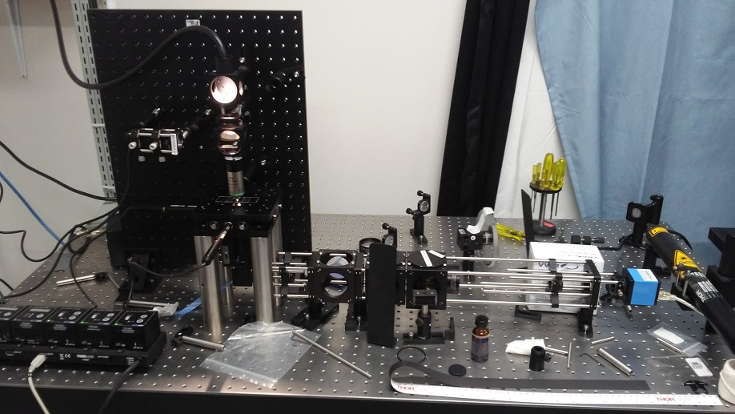

| **Arnaud Mercier - 111 156 297** | Date: 6 novembre 2018 |
| -------------------------------- | --------------------: |
|                                  |                       |

# Pince Optique							semaine 1

------

## Question préparatoires

### Pourquoi un objet ayant un indice de réfraction infériur au milieu ambiant ne pourra pas être capturé à l'aide d'un faisceau gaussien?

> La lumière ne sera pas déviée vers le centre de la particule et la force résultante ne poussera donc pas la particule vers le centre du faisceau. 

### Par quels atifices pourrait-on confiner cet objet?

> On pourrait modifier le milieu ambiant afin que son indice de réfraction soit inférieur à l'objet. Il serait aussi possible d'utiliser plusieurs laser de contraindre l'objet malgré la force résultante inverse. 

## Modification du montage fait par les autres équipes

Un laser He-Ne à été ajouté. Celui-ci est utilisé avec la *quadphotodiode* comme référentiel de position.  LA déviation du He-Ne va informer le *quad* sur la déviation de la bille.  Un Laser He-Ne est utilisé pour ne pas *bruler* le *quad*. Les deux faisceau (He-Ne et infrarouge YAG) doivent être doalligné en tout temps. Voir photo nouveau montage.

## Manipulations

### Réponse du détecteur:

*<u>Attention</u>* s'assurer que l'objecctif du bas est dans l'huile

Les 3 moteurs (X,Y,Z) sont ajusté pour voir bien une bille. On voit bien la frontière et aucune partie de l'image est saturé. Une fine ligne définie le contour de la cellule. Sa ne dérange pas trop car on veut que la particule soit au focus de la trappe et non de la lumière blanche.

- On allume le laser He-Ne et on le centre sur l'image de la caméra (X,Y). En bougeant en Z on peut alors voir 3 image de réflexions.

  1. réflexion entre huile et lamelle
  2. réflexion entre lamelle et échantillon
  3. réflexion entre échantillion et lame

- On veut se placer (en Z) entre la réflexion 2 et 3 , ce qui correspond au centre de l'échantillon (en Z)

- On éteint le laser He-Ne et on allume le YAG infrarouge.

- On place un échantillon et on essai de trouvé une bille pour la *trapp* 

  > - Il y a une densité de 10e-02 bille
  >
  > - il y a beaucoup de billes collé sur les paroie pas beaucoup en suspensions, dur d'en trouver une

- important de mettre la lame du bon coté (lamelle vers le bas) et de l'huile

  ### Calibration *quadCell*

- Une bille est centré et les parametres de *jog* sont ajusté dans la page **labView** *controle moteur* pour qu'on voit la cellule se déplacer sur tout l'écran durant une période d'envirion 6 à 7 secondes. 

- axe X

- > step-size = 0.05
  >
  > max velocity = 0.0058

- axe Y

- > step-size = 0.032
  >
  > max velocity = 0.0058

- Dans le logiciel **LabView** *PFL* les réglages suivants sont faits:

- > n. d'échantillons= 90000
  >
  > fréquence = 15000
  >
  > Ces réglages ont été calculé pour etre sur d'enregitré tout le déplacement de la bille

  nom de fichier :calibrationArnoLudoX.xslx et calibrationArnoLudoY.xslx sur l'ordinateur du labo. 

L'échantillonnage automatique n'as pas marché, il y a trop de bruit et un probleme d'enregistrement. EN ouvrant le logiciel du détecteur thorlabs on voit que si on bouge la bille au travers du faisceau nous obtenons la croube voulu. Nous allons donc faire ue calibration manuelle.

> step size 1 micron (limite des moteurs)(attention, backlash sur les moteurs)

On note les voltages initiaux sur  le capteur *quad* et à chaque step de 1 micron on note les voltage correspondant. Par la suit on approxime la région du centre comme une droite et on trouve les pentes.

Il a fallu faire ce processus pour les deux axes, les valeurs sont dans la table suivante:

> pente Y : 0.0087 [volt/micron]
>
> pente X : -0.0083 [volt/micron]

Les données son dans un fichier excel sur l'ordi de ludo : penteQuad.xlxs

| Distance ($\mu$m) | Tension (V) |
| ----------------- | ----------- |
| +/-               | +/-  0.005  |
| 0                 | 0.034       |
| 1                 | 0.034       |
| 2                 | 0.034       |
| 3                 | 0.032       |
| 4                 | 0.019       |
| 5                 | -0.032      |
| 6                 | -0.002      |
| 7                 | 0.004       |
| 8                 | 0.012       |
| 9                 | 0.025       |
| 10                | 0.031       |
| 11                | 0.060       |
| 12                | 0.070       |
| 13                | 0.058       |
| 14                | 0.037       |
| 15                | 0.038       |
| 16                | 0.037       |
| 17                | 0.037       |

- Cela donne une pente linéaire au centre de la courbe de **8700 V/m**.

#### Pente axe X

- On fait de même pour l'axe X, en prenant les mesures du Y Diff sur le QuadCell. 

| Distance ($\mu$m) | Tension (V) |
| ----------------- | ----------- |
| +/-               | +/- 0.005   |
| 0                 | -0.0062     |
| 1                 | -0.0063     |
| 2                 | -0.0070     |
| 3                 | -0.0070     |
| 4                 | -0.0065     |
| 5                 | -0.004      |
| 6                 | -0.002      |
| 7                 | 0.025       |
| 8                 | 0.045       |
| 9                 | 0.030       |
| 10                | 0.035       |
| 11                | 0.016       |
| 12                | 0.0063      |
| 13                | 0.00        |
| 14                | -0.009      |
| 15                | -0.012      |
| 16                | -0.023      |
| 17                | -0.035      |
| 18                | -0.035      |
| 19                | -0.049      |
| 20                | -0.03       |
| 21                | -0.006      |
| 23                | -0.006      |
| 24                | -0.005      |
| 25                | -0.005      |

- Cela donne une pente linéaire au centre de la courbe de **-8300 V/m**.

vu le fait qu'on avait pas beaucoup de données il a fallu enlever ceux qui sont abérrantes pour obtenir un belle droite.

### Caractérisation du puit de potentiel  (constante de trappe)

- Guillaume prépare un nouvel échantillon car les billes sont toutes collées sur la lame.
- On *trap* une nouvelle bille et on se déplace à à différentes vitesses. Il est important que la bille reste *trap* tout au long du déplacement
- On veut attendre d'être en vitesse constante avant de lire les voltages du *quad*.
- Pour chaque vitesse on note la différence de potentiel lu par le *quad* à la main.

- Nous l'Avons fait pour l'axe Y seulement.

| Vitesse (mm/s) | Différence de tension (V) |
| -------------- | ------------------------- |
| ----           | +/- 0.003                 |
| 0.02           | 0                         |
| 0.03           | 0.005                     |
| 0.05           | 0.010                     |
| 0.08           | 0.015                     |

À faire: calculer la constante de trappe .

# Pince Optique							semaine 2

------

#### But

Déterminer si le laser infrarouge peut être utilisé pour la mesure de position sur le QuadCell au lieu du laser secondaire de faible puissance. 

#### Protocole

- Vérifier le spectre permis par le bloc séparateur. 

  > Il est coté 50/50 pour 300-700nm alors que le laser est à 1064. La courbe ne semble toutefois pas tomber à zéro rapidement (40% vers 800nm). On va alors le garder et observer plus tard la quantité de lumière qui se rend sur le QuadCell. 

- Vérifier la puissance permise par le QuadCell PDQ80A.

  > Plage optimale de 400-1050nm, ce qui est assez. Le module (qui contient un filtre DN 0.6) explique qu'il est généralement utilisé avec puissances au dessous du 5mW avant filtre. 

- Choisir un capteur de puissance pour le laser infrarouge.

  > On utilise le détecteur thorlabs S121C qui accepte la plage 400-1100nm avec puissance maximale de 500mW. On utilise la roulette réfléchissante pour augmenterr graduellement la puissance jusqua 450 mW.

- Mesurer la puissance du laser infrarouge à l'entrée du circuit optique et s'assurer qu'elle soit inférieure à la puissance permise sur le QuadCell. 

  > Le filtre à densité neutre variable est d'abord orienté de sorte à laisser passer le moins de puissance possible. On observe 5mW
  >
  > On règle le filtre de sorte à obtenir 450 mW. 

- Enlever le filtre infrarouge avant le cube séparateur et placer ce dernier au dessus du cube, soit avant la  source de lumière blanche. Pour ne pas envoyé de la la lumière à la source.

- Mesure la puissance après le cube séparateur. (ebtré *quadCell*)

- Calcul du rapport de puissance entre l'entré du circuit optique  et l'entrée du *quadCell*

- > $$ \frac{\text{entré quadCell}}{\text{entrée circuit}} = \frac{1.6}{450} = 0.0038$$

### Résumé des pertes de puissances:

- 75 % de perte du au coatings inpropriées des différentes lentilles

- 85 % de perte à cause de la différence des NA entre les deux objectifs

- 75 % de perte à cause du prisme

- > Nous pouvons donc envoyé le maximum de puissance du laser sans aucune crainte pour le quad cell et les détecteurs

En démontant le *quadCell* nous nous sommes aperçu que les lentilles de celle-ci sont on un *coating* pour l'infrarouge, nous pouvons donc enlever le filtre laissant passé que 632.8 devant le *quadCell*

### Résumé des modificaions

1. Retiré le filtre infrarouge après le deuxième objectif (NA=0.5) car on veut que le laser infrafouge se rendre à la *quadCell*

2. Retiré le filtre ava le *quadCell* qui ne laissait passé que 632.8

3. > Il n'y a pas de phot du montage, car seulement 2 filtres ont été enlevés et aucun grosse modification n'ont été apportées.

La somme des puissance (recu par la quadCell) varie avec le passage de la pince par dessu une bille.

La somme des puissance (recu par la *quadCell*) varie avec le passage de la pince par dessu une bille.

> Ce phénomène semble venir du fait que le laser n'est aps collimé à la fin du prisme, il diverge bcp trop.