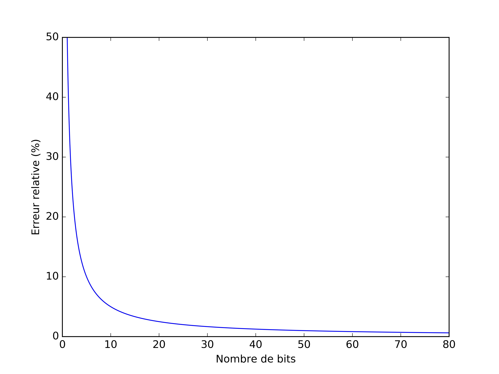
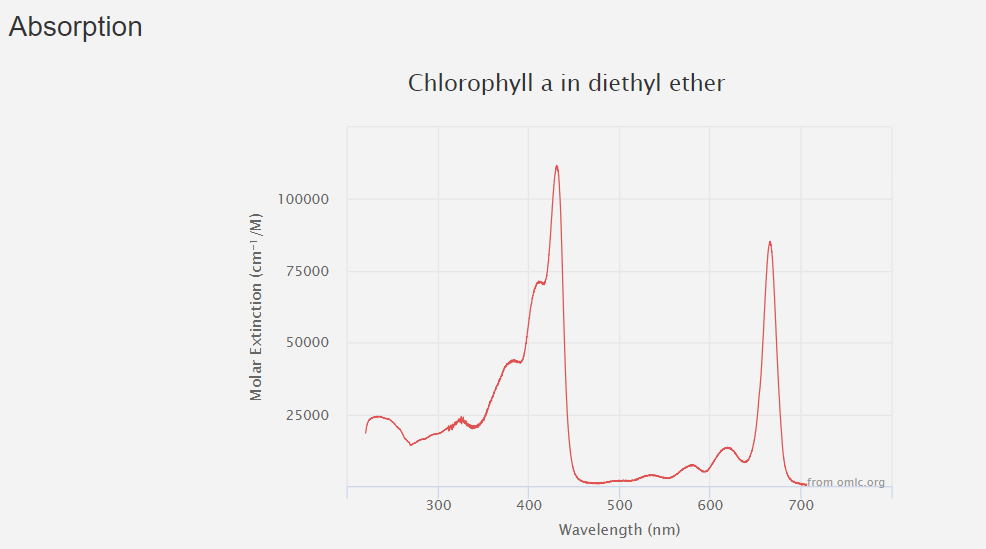
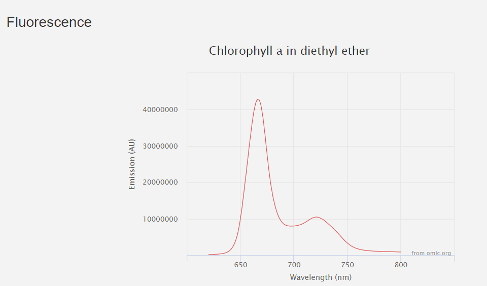

| **Arnaud Mercier - 111 156 297** | Date: 20 novembre 2018 |
| -------------------------------- | ---------------------: |
|                                  |                        |

# Spectroscopie Raman					semaine 1

------

## Question préparatoires

### Lignes de Mercure qui devront être observées dans le spectromètre durant l'étalonnage 

> Selon l'annexe 2,  le pic avec le plus intense est celui à 614.95 nm . Il serait donc bien de  le placer au début du capteur. Par la suite ds pics à 690, 708 et 709 possèdent une intnsité de 250, 250 et 200. 

### Profondeur des puits du capteur CCD

> Lien  vers la ficher technique de la caméra pixis 100b : [dataSheet](https://www.princetoninstruments.com/userfiles/files/assetLibrary/Datasheets/Princeton_Instruments_PIXIS_100_rev_5_1_10_22_14.pdf)
>
> Il existe 2 différents modes :
>
> *High sensitivity* : 300 ke- (typical), 250 ke- (min)
> *High capacity* : 1 Me- (typical), 750 ke- (min)
>
> Le nombre de photons requis pour agmenter la valeur d'un pixel de '1' ( valeur des pixels de 0 à 65535 (16bits)) dépend du mode d'opération. Considérons une efficacité quantique de 95%.
>
> *High sensitivity* : $$\frac{(0.95)300\text{ke-}}{65535}\approx 4.35 $$ photon par incrément
> *High capacity* : $$\frac{(0.95)1 \text{Me-}}{65535}\approx 14.5 $$ photon par incrément

### Graphique du bruit de photon en fonction du nombre de photons mesuré

> À cause du processus de numérisation (environ 5 photons pour 1 bit) une erreur absolue de $$\pm$$1 bit est toujours présente. C'est-à-dire qu'on ne voit que à coup de 5 photons. POur 12 photons mesurés, nous allons lire 2 bits. Cependant, nous sommes entre le 2ieme et le 3ieme bit. C'est pourquoi nous avons toujours une erreur de $$\pm1$$ peut importe le nombre de photons mesuré.
>
> 
>
> Il est aussi important de voir que dans la dataSheet, le fabricant spécifie des valeurs pour le bruit de lecture
>
> @ 100 kHz  $$\rightarrow$$  3 e- rms (typical), 5 e- rms (max)
> @2MHz $$\rightarrow$$ 11 e- rms (typical), 16 e- rms (max)

### Conversion longueur d'onde $\rightarrow$  nombre d'onde

> $$w = \left(  \frac{1}{\lambda_1} - \frac{1}{\lambda_2}\right)$$
>
> $$w_{632.8\rightarrow700 (nm)} = \left(  \frac{1}{632.8} - \frac{1}{700}\right)  =151.7 \text{cm}^{-1}$$
>
> [source](https://en.wikipedia.org/wiki/Raman_spectroscopy)

### Graphique du bruit en fonction du temps d'intégration

###Spectre d"émission et d'absoption de la chlorophyle

> tout est bine détaillé sur ce [site](https://omlc.org/spectra/PhotochemCAD/html/123.html).
>
> 

> 

### Taux de gras satrué/insaturé dans l'huile d'olive

> saturé $$ \rightarrow $$ 15% et donc insaturé $$\rightarrow$$ 85% selon [wiki](https://en.wikipedia.org/wiki/Olive_oil)
> Cependant ces valeurs dépendent de la qualité de l'huile. Voir aussi le document PDF sur le git pour des valeurs plus détaillées

## En laboratoire

## Montage

Introduction sur le montage: illumination, fentes, filtre onde plane, réseau holographique.

Introduction sur le bruit de photons, loi de poisson et tout...  la source provient que les evènements observée sont exxclusivement indépendnt et totalement aléatoire.

## Manipulations

- Logiciel d'acquisition : winspec32. Nous avons fixé le rate a 2MHz, le readout a low noise et le gain a 1 pour toute lexpérience

### Caractérisation de la CCD

#### Caractérisation du bruit de lecture

> Le binning somme sur les pixels, le max sur le graphique peut alors se rendre à 100x 65 535

- Mesures enregistrées dans un fichier. Sans illumination, soit seulement bruit de lecture

| Temps d'intégration (ms) | Nom du fichier          |
| ------------------------ | ----------------------- |
| 100                      | bruit_lecture_100ms.txt |
| 50                       | bruit_lecture_50ms.txt  |
| 25                       | bruit_lecture_25ms.txt  |
| 10                       | bruit_lecture_10ms.txt  |
| 5                        | bruit_lecture_5ms.txt   |
| 1                        | bruit_lecture_1ms.txt   |
| 0.1                      | bruit_lecture_100um.txt |
| 0.01                     | bruit_lecture_10um.txt  |
| 0.001                    | bruit_lecture_1um.txt   |

**Bruit moyen: ** 61 570 / 100px

#### Caractérisation du bruit thermique

- 

| Temps d'intégration (s) | Nom du fichier           |
| ----------------------- | ------------------------ |
| 1                       | bruit_thermique_1s.txt   |
| 5                       | bruit_thermique_5s.txt   |
| 10                      | bruit_thermique_10s.txt  |
| 25                      | bruit_thermique_25s.txt  |
| 50                      | bruit_thermique_50s.txt  |
| 100                     | bruit_thermique_100s.txt |

**Graphique du signal en fonction du temps d'intégration**

#### Caractérisation du bruit de photon

- On installe un papier blanc à l'échantillon avec lumière de la salle ouverte de sorte à rediriger la lumière blanche vers le spectromètre. 

| Temps d'intégration (s) | Nom du fichier         |
| ----------------------- | ---------------------- |
| 0.001                   | bruit_photon_1ms.txt   |
| 0.1                     | bruit_photon_100ms.txt |
| 1                       | bruit_photon_1s.txt    |
| 5                       | bruit_photon_5s.txt    |
| 10                      | bruit_photon_10s.txt   |

#### Étalonnage de la caméra sur l'axe des longueurs d'onde

- Lampe au mercure avec feuille blanche à l'échantillon.
- On observe bel et bien le spectre de la lampe avec ses pics principaux. 
- Enregistrement du spectre pour un temps d'intégration de 10s sur le fichier *spectre_mercure.txt*. 
- Pour l'instant nous n'avons pas effectuer la conversion de nm à pixel (selon l'alignement de la lampe au mercure)
  **Il est important d'enregistré le spectre de la lampe au mercure à chaque début de lab**

#### Alignement du spectromètre par fluorescence

- On observe l'image du spectromètre avec de l'huile d'olive à l'échantillon. 
- On aligne le tout en redirigant le faisceau incident par le miroir. On s'assure que l'image sur la caméra (en mode imaging) est bien centré en hauteur et en largueur.

#### Prise de spectres Raman pour solutions organiques

- Pour chaque échantillon, on enregistre son spectre pour un temps d'intégration de 100s. 
- Software binning

| Solution      | Nom du fichier  |
| ------------- | --------------- |
| Sucrose       | sucrose.txt     |
| Glycérol      | glycerol.txt    |
| Isopropanol   | isopropanol.txt |
| Méthanol      | methanol.txt    |
| Éthanol       | ethanol.txt     |
| Canola        | canola.txt      |
| Arachide      | arachide.txt    |
| Tournesol     | tournesol.txt   |
| Maïs          | mais.txt        |
| Huile d'olive | olive.txt       |

**PHOTOS !!**

**Trouver un moyen de séparer le signal de la fluorescence du signal Raman.** $$\rightarrow$$ on crois quil faut intégrer assez longtemps pour que le nombre de photon RAMAN soit au moins 5 fois plus grand que le bruit de photon.

- Longueur d'excitation différente  pour me pas excité autant la fluorescence de la chlorophyle ---> pas possible dans le cadre du labo.
- Trouver une différence dans la réponse de ces deux phénomènes par rapport à un certain paramètre (comme faire varier l'intensité de la source laser ?) ---> rien trouvé de concluant.

# Spectroscopie Raman					semaine 2

------

## 

### Amélioration du système

Comme discuter avec prof Daniel, afin d'augmenter le nombre photon raman qui se rend au spectromètre, il serait utile d'augmenter l'irradiance  à la premier fente du système. Pour ce faire, nous pouvons modifier le premier système 4f afin de diminuer la taille du faisceau sur la fente. **pas fait encore**

### Mesure du spectre Raman de l'huile d'olive

Le pics raman de l'huile d'olive sont très peu intense, moins intense que le bruit de photon. Pour etre capable de différencier le bruit de photon des pics raman, nous devons donc augmenté le ratio signal/bruit. En augmentant la durée de l'intégration le bruit de photons diminue (est moins important par rapport à la mesure). Il faut donc calculer le temps d'intégration nécessaire. 

>  Si nous voulons que le ratio signal sur bruit soit 5 fois supérieur qu'actuellement (1 pour 1) nous devons augmenté le temps d'intégration de $5^2$ donc de 100 secondes à  2500 secondes ($\approx 45$mins)

## In Lab

- Nous avons identifier un pic raman dans une acquisition antérieur de l'huile d'olive. Celui ci est à peine discernab;e par rapport au bruit de photon. 
- Selon nos calculs, il faut  diminuer le bruit d'un facteur 5 (pour que le pic raman soit 5 fois plus gros que le bruit). Nous devons donc intégrer plus longtemps d'un facteur: 25.
- Nous devons donc intégrer 25 * 100s = 40 minutes.

apres 40 minutes 500,000 photon sur un des pics en 2400 secondes 

Algrithme de soustraction de background

Brian Wilson

Michael Feld Jason Motz

Frederic Leblond

650 est 15384 cm -1

632.8 et 15802 

Huile de mais donne un pic d'environ 40,000 pres 100 secondes